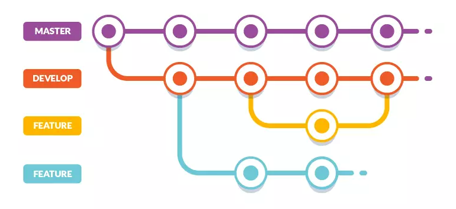

# IS212_SPM_G7_OpenRoleListing




SQL files are uploaded in the repository to download for the models to test the microservices.

Models are used to link the sql files and the microservices for data retrieval.


--------------PLEASE READ THE FOLLOWING BELOW TO RUN OUR SPM PROJECT!!!!!----------------

Start up wampserver64 and Login into PhpMyAdmin. Import the sql file: spm.sql located under the sql_data folder.


From a base directory ("wamp64\www\IS212_SPM_G7_OpenRoleListing-main" in this case), create a new environment on CMD CLI.
```
python -m venv spm-t3
spm-t3\scripts\activate
```


Run npm install to install the relevant packages from package.json
```
npm install
```

For each of the microservices below, run this code on a new terminal to navigate to the spm-t3 directory, run the venv and return to src/api directory. 
```cd spm-t3\Scripts && call activate && cd ../../src/api``` 

Once the terminal is in the environment & src/api, run each line of code below individually on its own terminal to start all the microservices. 
```
node staff_details_ms.js
node openroles.js
node apply_role_complexMS.js
node role_skills_ms.js
node roledetails.js
node apply.js
node rolelistings.js
node skill_details_ms
node staffskills.js
```


After running all microservices, open a new terminal and type the code below to test all unit testing TDD for microservices in our code. It should return 7 passed for files and 22 passed for tests.
```cd spm-t3\Scripts && call activate && cd ../../```
```npm test a```


Ctrl + C to keyboard interrupt to exit the npm test menu, and type ```npm start``` to run the frontend.
This will take a short minute to load all react.js components.


Ctrl + C to keyboard interrupt to exit the npm start to stop the frontend react.js


------END OF README-------
